# High-Performance Go Load Balancer

A robust, concurrent Load Balancer written in Go, designed to distribute traffic across multiple backend services using the Least-Connections algorithm (aware of backend load). This project demonstrates advanced Go concepts such as Goroutines, Atomic Operations, Mutexes for thread safety, and System Architecture.

## 🏗 Architecture

The system sits in front of a pool of backend servers. It performs active health checks in the background to ensure traffic is only routed to healthy instances.

```mermaid
graph TD
Client(Client Requests) -->|HTTP| LB[Go Load Balancer :3030]

subgraph "Server Pool (Least Connections)"
    LB -->|Route| App1[Backend 1]
    LB -->|Route| App2[Backend 2]
    LB -.->|❌ Detected Down| App3[Backend 3]
end

HC[Health Checker Worker] -.->|HTTP GET every 20s| App1
HC -.->|HTTP GET every 20s| App2
HC -.->|HTTP GET every 20s| App3

style App3 fill:#ffcccc,stroke:#ff0000
style LB fill:#d4edfc,stroke:#0052cc,stroke-width:2px
```



## ✨ Key Features

- ⚡ **Least-Connections Selection**: Traffic is routed to the backend with the fewest active connections (reduces latency imbalance).
- 🛡️ **Active Health Checks**: A background worker (Goroutine) pings backends periodically via HTTP. If a server fails (non-2xx status), it is automatically removed from the rotation.
- 🔒 **Thread-Safe Design**: Uses `sync.RWMutex` to manage concurrent reads/writes to the server pool status.
- 🚀 **Atomic Operations**: Uses `sync/atomic` for the request counter to avoid locking bottlenecks in the hot path.
- 🐳 **Docker Native**: Fully containerized with a Multi-Stage Build (Alpine based) for a lightweight production image.
- 📊 **Real-time Stats**: Exposes a `/stats` endpoint providing live metrics (uptime, memory usage) for each backend.

## 🚀 Getting Started

The easiest way to run the project is using Docker Compose. It will spin up the Load Balancer and 3 dummy backend services (traefik/whoami) to simulate a cluster.

### Prerequisites

- Docker & Docker Compose
- Go 1.22+ (optional, for local dev)

### Running the Stack

```bash
# 1. Clone the repository
git clone https://github.com/P4ST4S/go-load-balancer.git
cd go-load-balancer

# 2. Start the infrastructure
docker-compose up --build
```

The Load Balancer will start on http://localhost:3030.

## 🧪 Testing & Demo

### 1. Verify Round-Robin

Open a terminal and send multiple requests. You will see the response coming from different containers (observe the `Hostname` field):

```bash
curl http://localhost:3030
# Output: Hostname: f33e964c5fe9 (Server 1)

curl http://localhost:3030
# Output: Hostname: a82b12c5558d (Server 2)
```

### 2. Verify Fault Tolerance (Chaos Test)

Simulate a server crash by stopping one of the backend containers:

```bash
docker stop app2
```

Watch the Load Balancer logs. Within seconds, you will see:

```
Status change: http://app2:80 [down]
```

Now, run `curl` again. You will notice that traffic is never routed to the stopped server.

### 3. Check Statistics

You can monitor the health and resource usage of your backends in real-time:

```bash
curl http://localhost:3030/stats | jq
```

Output:
```json
[
  {
    "url": "http://app1:80",
    "alive": true,
    "uptime": "00h:05m:23s",
    "memory_usage": "1.2 MB"
  },
  ...
]
```

## 🧠 Technical Highlights

### Concurrency & Safety

To handle high throughput, the `ServerPool` uses a **Race-Condition Free** design:

- **Reads (`IsAlive`)**: Protected by `RWMutex.RLock()` allowing multiple concurrent readers.
- **Writes (`SetAlive`)**: Protected by `RWMutex.Lock()` ensuring exclusive access during health updates.

### Atomic Counter

For the Round-Robin index, I chose `atomic.AddUint64` instead of a standard Mutex.

**Why?** Mutexes are expensive. In a high-load scenario (10k req/sec), locking the counter for every request creates a bottleneck. Atomic CPU instructions are non-blocking and significantly faster.

### Worker Pool for Stats

To prevent goroutine leaks when fetching statistics from potentially slow backends, I implemented a **Worker Pool** pattern.

- A fixed number of workers (3) consume update tasks from a buffered channel.
- If the channel is full (backpressure), new updates are skipped until workers are available.
- This ensures the main health check loop is never blocked by slow network calls.

## 🔮 Future Improvements

- [ ] Implement Weighted Round-Robin for servers with different capacities.
- [ ] Add Least Connections algorithm.

---

Made with ❤️ and Go.
